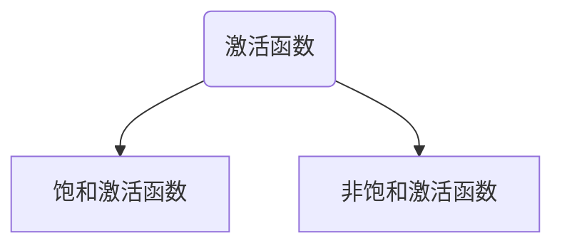

## 1. 卷积有什么特点
```text
1. 局部感受野：卷积通过一个较小的滤波器来滑动滤遍输入，滤波器只能关注局部特征
每一次的卷积操作只能处理局部的特征。
2. 权值共享：在卷积操作中使用的都是同一个卷积核，这大大的减少了参数量
3. 平移不变性：卷积操作具有一定的平移不变性。也就是说，卷积网络能够识别图像中的某些特征，无论这些特征的位置如何变化。
卷积核提取到的特征能够在不同的空间位置上进行识别和表达。
```
## 2. 有什么归一化方法
|      归一化方法       |                    原理                     |                                                           优点                                                           |
|:----------------:|:-----------------------------------------:|:----------------------------------------------------------------------------------------------------------------------:|
|       批归一化       | 通过对每一层的输出在一个小批量（batch）内进行标准化，BN应作用在非线性映射前 |                                              1. 加快模型训练速度<br/>2. 缓解梯度爆炸的问题                                              |
|       层归一化       |        神经网络的每一层中，对该层所有神经元的激活值进行归一化        | 1. 防止了激活值过大或过小导致的梯度消失或梯度爆炸问题<br/>2. 相比 Batch Normalization，LayerNorm 更适用于小批量训练、序列建模（如 RNN）等场景，因为它不依赖于 mini-batch 的统计信息 |
|      实例归一化       |      每个样本在通道维度上进行归一化，通常用于风格迁移和图像生成任务      |                                                可以有效控制图像的风格和内容分离，增强生成效果                                                 |

## 3. 在分类任务中，如果你需要输出七种类别，但实际上你输出的结果多了一个维度，请问你该如何用pytorch来解决
* 去除多余的维度，可以通过裁剪输出的最后一列（或指定维度）来解决问题
* 使用切片：截取前七个输出与目标匹配并输入到损失函数中
* 使用自定义的标签映射：如果第 8 类实际上需要映射为某种特殊状态（比如 "其他" 或 "背景"），可以在损失函数处理之前，自定义对输出的逻辑调整

## 4. 常见池化方法
```text
池化的主要目的：
1. 保持主要特征不变的情况下，减少参数量
2. 保持平移、旋转、尺度不变性，增强了神经网络的鲁棒性
3. 池化操作也可以在一定程度上控制过拟合，通过减小特征图的尺寸，
   池化可以减小模型中的参数数量，并降低模型的复杂度。这有助于防止模型过度拟合训练数据，提高模型的泛化能力
```
|    池化方法     |         方法          |                            特点                             |
|:-----------:|:-------------------:|:---------------------------------------------------------:|
|    最大池化     |  在池化窗口中选取最大的值作为输出   |           1. 在保留图像特征的同时，减少了参数量<br/>2. 能突出图像中的一些特征，适合捕捉边缘和尖锐的激活 |
|    平均池化     | 在池化窗口中计算所有值的平均值作为输出 |       1. 会保留更多的图像背景特征，会平滑特征值<br/>2. 适合需要平滑特征或不太强调局部强特征的任务 |
| 全局平均池化（GAP） |将每个通道的所有值进行平均，直接输出一个全局的值|大大降低模型参数，缓解过拟合|
| 全局最大池化（GMP) | 对每个通道的所有值取最大值，输出每个通道的最大值|选取最显著的特征，适用于目标需要非常突出的任务|

## 5. 常见的损失函数
1. 均方误差（MSE)损失函数</br>

   $loss = \frac{1}{N} \sum(\hat{y}-y)^2 $</br>
    特点：对于离群点比较敏感
2. 平均绝对误差（MAE）</br>
   $ loss = \frac{1}{N} \sum| \hat{y}-y|$</br>
     特点：对离群点不敏感
3. 交叉熵损失（Cross-Entropy Loss）</br>
   $ loss= -\frac1 N\sum y log{\hat{ (y)}}$</br>
     特点：测量分类任务中预测分布与真实分布的距离，通常用于多分类的任务（通常结合sofmax）
4. 二元交叉熵损失（Binary Cross-Entropy, BCE Loss）</br>
   $ BCE\enspace loss=-\frac1 N \sum{y\:log(\hat{y})+(1-y)\;log(1-\hat y) }$</br>
     特点：通常适用于二分类任务，与sigmoid结合使用

## 6. 常见的激活函数

```text
1. 饱和激活函数：当经过激活函数的输入趋于正无穷时，其导数为0时，该激活函数称为右饱和
            当经过激活函数的输入趋于负无穷时，其输出值的导数为0，则称为左饱和函数
            当你一个激活函数同时满足左饱和和右饱和时，则该激活函数称为饱和激活函数
            （sigmoid、tanh）--->容易出现梯度消失的问题
2. 非饱和激活函数：当既不满足左饱和或右饱和时，则称为非饱和激活函数
```

1. sigmoid函数</br>
    $ \large {sigmoid = \frac{1}{1+e^{-x}}} $</br>
```text
1. sigmoid激活函数的输出值在0到1之间，尝尝用于二分类任务
2. 容易出现梯度消失问题，因为这是一个饱和激活函数
```

2. tanh函数</br>
$ \large {tanh = \frac{e^x - e^{-x}}{e^x+e^{-x}}}$
```text
1. tanh同样适用于二分类任务，且输出值的范围为[-1，1]
2. 相对于sigmoid函数，tanh的输出值是0
3. 但是仍然会存在梯度消失的问题，这同样是一个饱和激活函数
```

3. ReLU激活函数</br>
   $ \large{Relu=max(0,x)}$</br>

```text
1. 该激活函数的输出值为0到无穷
2. 计算简单，收敛速度快，不容易发生梯度消失的问题
3. 在极小的输入值是，可能会导致“死亡神经元”问题（即神经元永远不会激活）
```


4. Leaky ReLU</br>
   $ \large{leaky \; ReLu=max(ax,x)}$
```text
1. 相对于ReLu,输入值为负时输出与输入呈线性关系，从而解决了“死亡神经元”的问题。
```
5. softmax函数</br>
$ Softmax(x)=\frac{e^x}{\sum{e^x}}$</br>
```text
1. 将输出转换为概率，其总和为1
2. 尝试用于多分类的输出层
```


## 7. 过拟合与欠拟合的表现及解决方法

