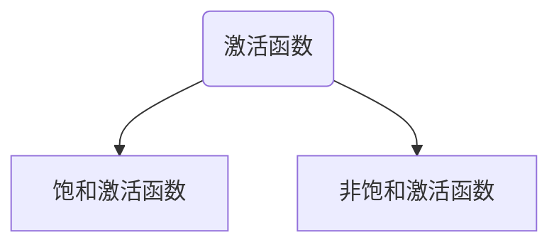
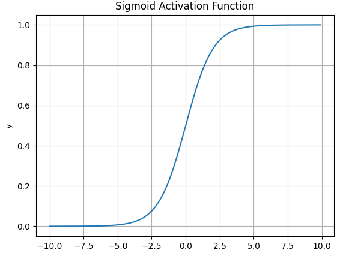
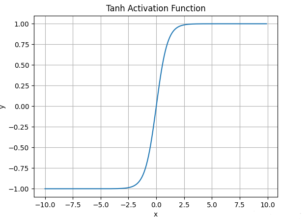
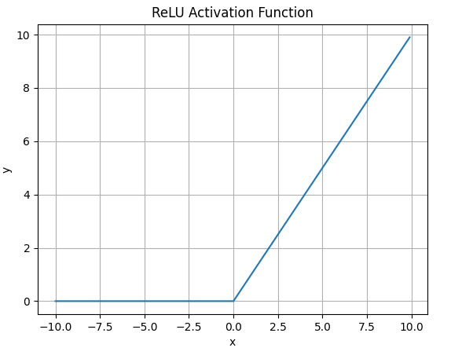
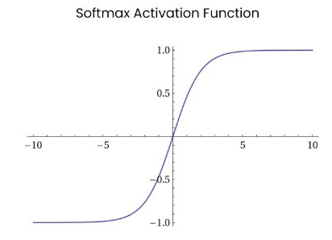
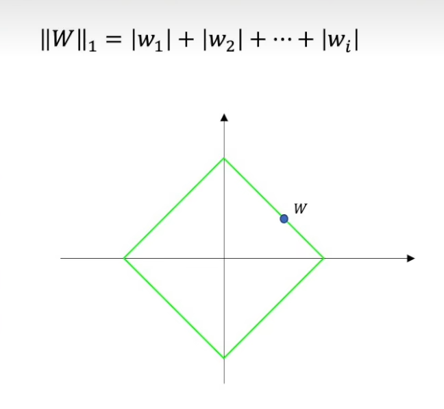
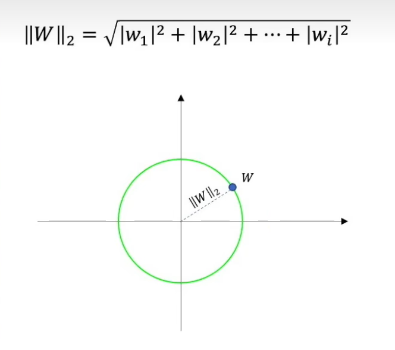
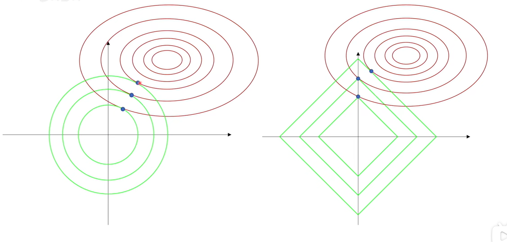
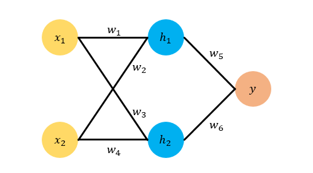

## 1. 卷积有什么特点
```text
1. 局部感受野：卷积通过一个较小的滤波器来滑动滤遍输入，滤波器只能关注局部特征
每一次的卷积操作只能处理局部的特征。
2. 权值共享：在卷积操作中使用的都是同一个卷积核，这大大的减少了参数量
3. 平移不变性：卷积操作具有一定的平移不变性。也就是说，卷积网络能够识别图像中的某些特征，无论这些特征的位置如何变化。
卷积核提取到的特征能够在不同的空间位置上进行识别和表达。
```
## 2. 有什么归一化方法
|      归一化方法       |                    原理                     |                                                           优点                                                           |
|:----------------:|:-----------------------------------------:|:----------------------------------------------------------------------------------------------------------------------:|
|       批归一化       | 通过对每一层的输出在一个小批量（batch）内进行标准化，BN应作用在非线性映射前 |                                              1. 加快模型训练速度<br/>2. 缓解梯度爆炸的问题                                              |
|       层归一化       |        神经网络的每一层中，对该层所有神经元的激活值进行归一化        | 1. 防止了激活值过大或过小导致的梯度消失或梯度爆炸问题<br/>2. 相比 Batch Normalization，LayerNorm 更适用于小批量训练、序列建模（如 RNN）等场景，因为它不依赖于 mini-batch 的统计信息 |
|      实例归一化       |      每个样本在通道维度上进行归一化，通常用于风格迁移和图像生成任务      |                                                可以有效控制图像的风格和内容分离，增强生成效果                                                 |

## 3. 在分类任务中，如果你需要输出七种类别，但实际上你输出的结果多了一个维度，请问你该如何用pytorch来解决
* 去除多余的维度，可以通过裁剪输出的最后一列（或指定维度）来解决问题
* 使用切片：截取前七个输出与目标匹配并输入到损失函数中
* 使用自定义的标签映射：如果第 8 类实际上需要映射为某种特殊状态（比如 "其他" 或 "背景"），可以在损失函数处理之前，自定义对输出的逻辑调整

## 4. 常见池化方法
```text
池化的主要目的：
1. 保持主要特征不变的情况下，减少参数量
2. 保持平移、旋转、尺度不变性，增强了神经网络的鲁棒性
3. 池化操作也可以在一定程度上控制过拟合，通过减小特征图的尺寸，
   池化可以减小模型中的参数数量，并降低模型的复杂度。这有助于防止模型过度拟合训练数据，提高模型的泛化能力
```
|    池化方法     |         方法          |                            特点                             |
|:-----------:|:-------------------:|:---------------------------------------------------------:|
|    最大池化     |  在池化窗口中选取最大的值作为输出   |           1. 在保留图像特征的同时，减少了参数量<br/>2. 能突出图像中的一些特征，适合捕捉边缘和尖锐的激活 |
|    平均池化     | 在池化窗口中计算所有值的平均值作为输出 |       1. 会保留更多的图像背景特征，会平滑特征值<br/>2. 适合需要平滑特征或不太强调局部强特征的任务 |
| 全局平均池化（GAP） |将每个通道的所有值进行平均，直接输出一个全局的值|大大降低模型参数，缓解过拟合|
| 全局最大池化（GMP) | 对每个通道的所有值取最大值，输出每个通道的最大值|选取最显著的特征，适用于目标需要非常突出的任务|

## 5. 常见的损失函数
1. 均方误差（MSE)损失函数</br>

   $loss = \frac{1}{N} \sum(\hat{y}-y)^2 $</br>
    特点：对于离群点比较敏感
2. 平均绝对误差（MAE）</br>
   $ loss = \frac{1}{N} \sum| \hat{y}-y|$</br>
     特点：对离群点不敏感
3. 交叉熵损失（Cross-Entropy Loss）</br>
   $ loss= -\frac1 N\sum y log{\hat{ (y)}}$</br>
     特点：测量分类任务中预测分布与真实分布的距离，通常用于多分类的任务（通常结合sofmax）
4. 二元交叉熵损失（Binary Cross-Entropy, BCE Loss）</br>
   $ BCE\enspace loss=-\frac1 N \sum{y\:log(\hat{y})+(1-y)\;log(1-\hat y) }$</br>
     特点：通常适用于二分类任务，与sigmoid结合使用

## 6. 常见的激活函数

```text
1. 饱和激活函数：当经过激活函数的输入趋于正无穷时，其导数为0时，该激活函数称为右饱和
            当经过激活函数的输入趋于负无穷时，其输出值的导数为0，则称为左饱和函数
            当你一个激活函数同时满足左饱和和右饱和时，则该激活函数称为饱和激活函数
            （sigmoid、tanh）--->容易出现梯度消失的问题
2. 非饱和激活函数：当既不满足左饱和或右饱和时，则称为非饱和激活函数
```

1. sigmoid函数</br>
    $ \large {sigmoid = \frac{1}{1+e^{-x}}} $</br>
```text
1. sigmoid激活函数的输出值在0到1之间，尝尝用于二分类任务
2. 容易出现梯度消失问题，因为这是一个饱和激活函数
```

2. tanh函数</br>
$ \large {tanh = \frac{e^x - e^{-x}}{e^x+e^{-x}}}$
```text
1. tanh同样适用于二分类任务，且输出值的范围为[-1，1]
2. 相对于sigmoid函数，tanh的输出值的中心是0
3. 但是仍然会存在梯度消失的问题，这同样是一个饱和激活函数
```

3. ReLU激活函数</br>
   $ \large{Relu=max(0,x)}$</br>

```text
1. 该激活函数的输出值为0到无穷
2. 计算简单，收敛速度快，不容易发生梯度消失的问题
3. 在极小的输入值是，可能会导致“死亡神经元”问题（即神经元永远不会激活）
```


4. Leaky ReLU</br>
   $ \large{leaky \; ReLu=max(ax,x)}$
```text
1. 相对于ReLu,输入值为负时输出与输入呈线性关系，从而解决了“死亡神经元”的问题。
```
5. softmax函数</br>
$ Softmax(x)=\frac{e^x}{\sum{e^x}}$</br>
```text
1. 将输出转换为概率，其总和为1
2. 尝试用于多分类的输出层
```


## 7. 过拟合与欠拟合的表现及解决方法
|    |                                  表现                                   |                                                                         解决方法                                                                         |
|:--:|:---------------------------------------------------------------------:|:----------------------------------------------------------------------------------------------------------------------------------------------------:|
|过拟合| 在训练集中，模型的表现效果较好，而在新的数据中，模型的效果差。模型在训练时过度记住了训练数据的细节和噪声，导致它无法很好地泛化到新的数据。 | 1. 减少网络层或节点数，降低网络的复杂度<br/>2. 可以使用L1和L2正则化<br/>3. 使用 Dropout层，随机丢弃部分的神经元，提高范化能力<br/>4. 早停（Early Stopping）：在训练过程中，监控验证集的误差，当验证误差开始上升时停止训练，防止模型继续学习到噪声。 |
|欠拟合|模型在训练集和测试集上表现的效果都比较差，这可能是因为模型过于简单，没有学习到数据中的重要特征|                                   1. 增加模型的复杂度，添加模型的层数或者神经元<br/>2. 减少模型中的正则化，适当减小正则化的系数，给模型更多的自由度<br/>3. 增加模型的特征输入                                    |

## 8. L1正则化和L2正则化
```text
首先你需要明白，输入经过神经元的输出，在还未经过激活函数前，y = wx+b,其中，w是每一个输入的权重，这直接决定了你的拟合曲线是什么样子的
而b作为偏置，不会改变曲线的样子，只会改变曲线的平移情况。
在模型的训练过程中，我们需要找到一组使损失函数达到最小的一组参数w和b，但是，即使达到了最小的损失函数值，其对应的参数w和b也会天差地别，有的比较大有的又会比较小
当参数太大时，会放大输入中的噪声和误差，导致过拟合的问题
所以，要取到一个合适的参数，需要人为的设定一个参数范围，即可行域，如下图可见，绿色的方框和圆框即为参数w的可行域
(dropout也是一种正则化)
```
b站一个讲的很好的视频（【“L1和L2正则化”直观理解(之一)，从拉格朗日乘数法角度进行理解】 https://www.bilibili.com/video/BV1Z44y147xA/?share_source=copy_web&vd_source=f3637fca25bb78e0a8d449a17b91f37f ）
###  L1正则化
$||W||_1=|W_1|+|W|_2+|W|_3+...+|W|_n$</br>
那么，其在二维上的图像为一个正方形，中心在原点处

在模型的训练过程中，目标是要找到使得损失最小的参数值，正则化的目标是要给这个参数加上一个约束。
对于L1正则化，假设损失函数的值为J(w),根据拉格朗日乘子法，若要将参数约束在一个范围C内，即$ ||W||_1-c<0$,令</br>
$ L(w,\lambda )=J(w)+\lambda(||W||_1-c)$</br>
该式子得到的解空间与式子一致：</br>
$ L(w,\lambda )=J(w)+\lambda||W||_1$</br>
L1正则化会产生稀疏性：
+ 几何原因：L1正则化的参数往往落在一个菱形的顶点处，而这个顶点处往往处于某一条轴上，则
除了该轴上有值，其他维度的w的值会为0，所以会尝试稀疏性，从而实现特征选择和模型简化的效果，可以剔除不相关的特征
### L2正则化
$ ||W||_2=w_1^2+w_2^2+w_3^2+...+w_n^2$</br>
那么，其在二维上的图像为一个圆，中心在原点处

对于L2正则化，公式上同理为：</br>
$ L(w,\lambda )=J(w)+\lambda||W||_2$</br>
得到的解为圆与等值线相交的点，对于可行域是一个圆，
L2 正则化不会将权重缩减到零的核心原因在于其更新规则是与权重值成比例的线性缩减方式，这会使权重值逐步减小到接近零，但由于始终保留了一定比例更新，权重无法完全归零。这种特性使 L2 正则化更适合应用在保留所有特征权重的场景



## 9. ReLU函数在0处不可导，为什么还能用
* ReLu的梯度计算非常简单，因此，在反向传播时，它非常高效，可以大大减少计算成本。
* 反向传播算法是基于梯度下降的，ReLU 在大多数点（除了 0）都有明确的梯度，只有
在 0 处存在不可导的情形。对于实际应用中，通常会选择对 0 处不可导的点进行一个约定，将其梯度设置为 0 或 1。
* 与 Sigmoid 或 Tanh 函数相比，ReLU 不会在正半轴内出现梯度消失的问题（即梯度一直变得非常小）

## 10. Pooling层的作用以及如何进行反向传播
### 10.1 作用
Pooling 层是卷积神经网络（CNN）中常见的一个重要层，其主要作用是下采样（down-sampling）输入特征图，
减少数据的空间维度，从而降低计算量，同时保持图像中最重要的特征信息。
* 下采样：通过对输入特征图进行池化操作，降低空间维度（宽度和高度），从而减少计算量和存储需求。
* 特征抽取：通过池化，保留局部区域内的主要信息，减少不重要的细节。
* 防止过拟合：ooling 能够帮助减少模型的复杂度，减缓过拟合问题

### 10.2 如何进行反向传播
在神经网络训练过程中，反向传播（backpropagation）是通过链式法则计算损失函数对每个参数的梯度的过程。
* max pooling: 在最大池化过程中，正向传播中，我们只关注池化窗中的最大值，并以此作为输出，
所以，在反向传播中，也同样依赖于最大值，我们将损失输入到最大值对应的位置来计算梯度，而其他位置的梯度则设置为0
* Average Pooling: 在正向传播中，输出为池化窗口中的平均值，在反向传播中会将梯度均匀的分配给该窗口的每个元素

## 11. 推导反向传播
以下图中的神经网络为例子，假设激活函数为sigmoid

$ \large h_1=sigmoid(w_1x_1+w_2x_2+b_1)$  
$ \large h_2=sigmoid(w_3x_1+w_4x_2+b_1)$  
$ \large \hat y=sigmoid(w_5h_1+w_6h_2+b_2)$  
$ \large loss = (\hat y-y)^2$  
如果需要更新$ w_5$,设学习率为$ \lambda$  
$ \large w_5^+=w_5-\lambda \frac{ dL}{d\hat y} \frac{d\hat y}{dw_5}$  
同理，若需要更新$ w_1$  
$ \large w_1^+=w_1-\lambda \frac{dl}{d\hat y}\frac{d\hat y}{dh_1}\frac {dh_1}{w_1}$
更新其他参数同理

## 12. 详解深度学习中的梯度消失、爆炸原因及其解决方法